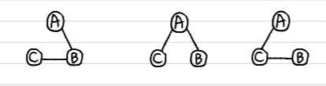

# 🎄신장트리 

`정의`
- 그래프내의 모든 정점을 포함하는 트리
- 트리의 특수한 형태로
    1. 모든 정점들이 연결되어 있어야 한다.
    2. 사이클을 포함해서는 안된다.
- 하나의 그래프에는 많은 신장 트리가 존재 가능하다. </br>

    

- dfs 또는 bfs 도중에 사용된 간선들만 모으면 생성할 수 있다.
 
    ```C
    dfs(v) : 
        v를 방문되었다고 표시;
        for all u ∈ (v에 인접한 정점) do
            if(u가 아직 방문되지 않았으면)
                then (v, u) 를 신장 트리 간선이라고 표시;
                    dfs(u)
    ```

- 그래프의 최소 연결 부분 그래프
    - 최소: 간선의 수가 가장 적다.
- 그래프는 최소한 n - 1개의 간선을 가져야하며 (n-1)개의 간선으로 연결되어 있다면? 
    - => **신장트리**❕

- 통신 네트워크 구축에 많이 사용된다.

# 🌲최소 비용 신장트리 
## MST
### Minimum Spanning Tree

`신장 트리 中 사용된 간선들의 합이 최소인 신장트리!`

- 도로건설, 전기회로, 통신, 배관

-방법 : 
- **Kruskal MST**
- **PRIM MST**

