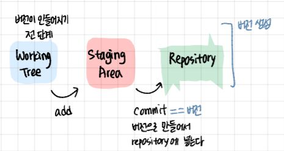

# 1. Git 버전관리 👀
## 1) 버전관리의 시작 
### `git init`
* git을 시작한다. 
* .git이라는 저장소가 생긴다.
    * `.git?` : git repository
### `git init .`
* 현재 디렉토리를 깃에게 버전관리를 시킨다.
___
 

## 2) 버전 생성 
### `git status`
* working tree의 status
    * `working tree?` : 버전이 만들어지기 전 단계로 파일이 생성되고 수정된 후 아무것도 하지않은 상태
### `git add`
* add to staging area
    * `staging area?` : working tree 에 있는 파일들 중 repository에 넣을 것들을 staging area에 올려놓는다.
### `git commit`
* create version
: 버전으로 만들어서 repository에 넣는다.

### `git commit -m "MESSAGE 1"`
* message 작성과 한번에 commit
 

--> 버전 생성의 한 과정 

### `git log`
* show version : 버전이 잘 만들어졌는 지 확인
---
 

## 3) 여러개의 파일을 하나의 버전으로 만들기 
### `git log --stat`
* 연관된 파일들을 다 보여주는 명령어 
___
 

## 4) 버전간의 차이점 비교 
### `git diff`
* show changes

### `git log -p`
* 어디에서 문제가 생겼는지 아주 유용하게 알 수 있는 명령어 

---
 

## 5) CheckOut과 시간여행 
### `git checkout [commit id]`
* 특정 버전으로 working tree를 변경한다. 
* head가 가리키는 위치를 commit id 위치로 변경한다.
___
 

## 6) git reset
### `git reset --hard [commit id]`
* commit id의 버전으로 리셋하겠다.
* commit id의 버전을 지우겠다 절대 아님! ❌
    * 만약 버전만 삭제하고 수정한 건 남기고 싶다면 : --hard가 아닌 다른 옵션으로 변경
    * 협업 시 : 공유되기 전 것만 reset해야함!

___
 

## 7) git revert
### `git revert [commit id]`
* 삭제 + 보전
* commit id의 버전에서의 변화를 취소하고 전 버전이 됨 
* but! commit id의 버전은 사라지지 않는다.
* 📌반드시 가장 최근의 버전부터 역순으로 차례대로 revert한다. 
    * 그렇지않으면, conflict

___
 

## 8) 버전관리의 핵심
### `diff tool` 
* 차이점을 정교하게 비교하여 정확한 의사결정을 내리고 현재상황을 신속하게 파악하는데 큰 도움이 된다.

### `.gitignore`
* 버전 관리를 하지 않아야 할 파일의 이름을 적는다.

### `brach`
* 하나의 저장소에서 다양한 작업이 가능하다.

### `commit id`
* tag 이용 시 tag 이름으로 관리 가능하다.

### `back up`
* git으로 백업이 가능하다.